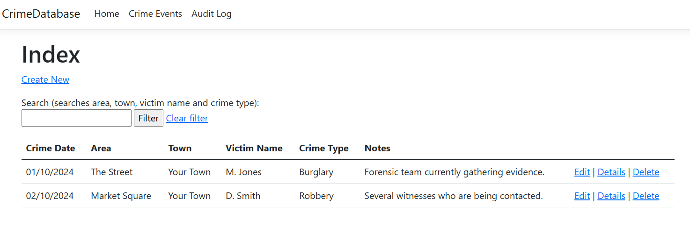

CrimeDatabase
=============

An ASP.NET Core MVC project using SQL Express Local DB for demonstrating software development capabilities.

Open the solution using Visual Studio - the .sln file can be found under /CrimeDatabase

The main project 'CrimeDatabase' includes two entity types: `CrimeEvent` for recording crime details and `AuditLog` which is written to every time a crime is added, updated or deleted. The crime type options used to make the field a drop-down in the user interface are provided in `CrimeTypeEnum`.

A separate project 'CrimeDatabaseTests' includes some basic unit tests for the main controller using the xUnit and 'Moq' testing frameworks.

Note: For development purposes a local SQL Server DB file (test-database.mdf) is included which is copied to the build folder when the project is built and run.

See the screenshot below for an example of the user interface:

